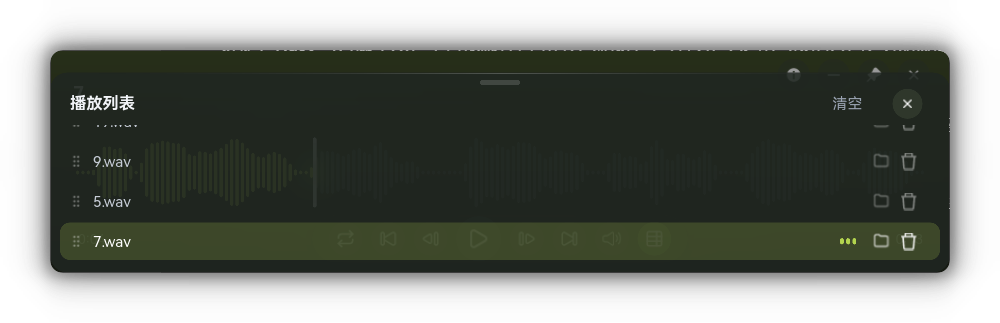

# zzh-music-player

一款为 Windows 打造的本地音乐播放器。小巧、优雅、美观，用 Rust 和 Slint 写成。


## 界面预览




## 功能

**播放**

支持 MP3、FLAC、WAV、OGG、M4A/AAC。四种播放模式：顺序、列表循环、单曲循环、随机。关闭时会记住播放列表、进度、音量和模式，下次打开接着听。

**专辑封面**

自动读取内嵌封面并提取主色，背景、波形、按钮全部跟着封面变色。MP3 的封面由内置的 ID3v2 解析器读取，v2.2 / v2.3 / v2.4 都支持。没有封面的歌曲会隐藏封面区域，并根据文件名生成一个固定不变的专属色调。

**波形进度条**

打开歌曲时在后台解码全部 PCM 数据，生成镜像波形。已播放部分用主题色高亮，播放头平滑滑动；鼠标悬停可以预览任意位置的精确时间，点击或拖动即可跳转。针对响度战音乐（整体压得很响的歌）做了动态范围拉伸，波形不会糊成一片长条。

**播放列表**

底部滑出的抽屉。按住行首手柄拖动即可排序，浮块跟着鼠标走，拖到列表上下边缘会自动滚动；轻点一行播放，行内还有打开所在文件夹和删除按钮。拖入文件夹会在后台扫描并逐批加入列表，大文件夹也不用等。

**细节**

暂停和切歌有音量淡入淡出；空格播放暂停；左右方向键快进快退；滚轮调音量；窗口可置顶；重复打开时文件自动转发给已经运行的实例；关于页面可以直达项目仓库。

## 本地缓存

首次播放会把波形分析结果存到本地缓存，之后再次播放同一首歌，波形、封面、标题直接读取，不需要重新解码。缓存会自动清理，源文件被修改或删除后自动失效。

## 安装

到 [Releases](https://github.com/zzhzhouzhou/zzh-music-player/releases) 下载 `zzhMusicPlayer_Setup.exe`，双击安装。安装器会注册 .mp3 / .flac / .wav 的打开方式，之后双击音频文件直接播放。

自己构建：

```
git clone https://github.com/zzhzhouzhou/zzh-music-player.git
cd zzh-music-player
cargo build --release
```

构建产物在 `target\release\zzhmusicplayer.exe`。需要安装包的话，用 Inno Setup 编译 `installer.iss` 即可。

## 技术栈

Rust · Slint · rodio · symphonia。音频解码和波形分析都在后台线程完成，界面线程只负责渲染。

## 许可证

[MIT](LICENSE)
