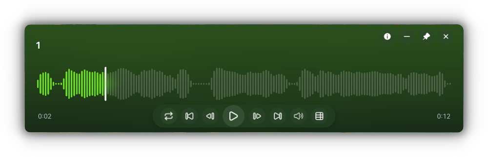
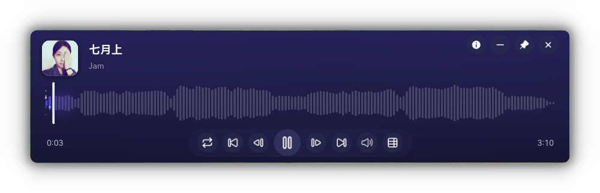

# zzh-music-player

> 一款简洁、轻量、纯粹的音频播放器


---

## 界面预览





---

## 特性

- **核心播放**  
  支持 MP3、FLAC、WAV、OGG、M4A/AAC 等常见格式。

- **智能视觉**  
  自动提取内嵌专辑封面（MP3 ID3v2 / FLAC / M4A）展示在左侧，并取封面主色作为渐变背景；无封面时根据文件名哈希生成专属色调，封面区域自动隐藏。

- **波形进度条**
  实时解码 PCM 生成圆润镜像波形，已播主题色高亮、白色播放头随进度平滑滑动，点击/拖拽/悬停预览跳转。

- **播放列表**  
  支持拖拽添加、列表循环 / 单曲循环 / 随机播放。列表自动持久化。

- **窗口置顶**  
  窗口置顶，随时调整，不受突然窗口影响

- **记忆播放**  
  自动保存当前播放列表、播放进度、音量和播放模式。下次打开，接着听。

- **双击文件关联**  
  在系统设置中设为默认音乐播放器后，双击音频文件即可直接播放。

---

## 安装与使用

### 下载预编译版本

前往 [Releases](https://github.com/zzhzhouzhou/zzh-music-player/releases) 页面下载最新的 `zzhMusicPlayer_Setup.exe`，运行安装程序即可。


# 克隆仓库

```
git clone https://github.com/zzhzhouzhou/zzh-music-player.git
cd zzh-music-player
```


# 构建发布版本

```
cargo build --release
```

# 运行

```
./target/release/zzh-music-player.exe
```
